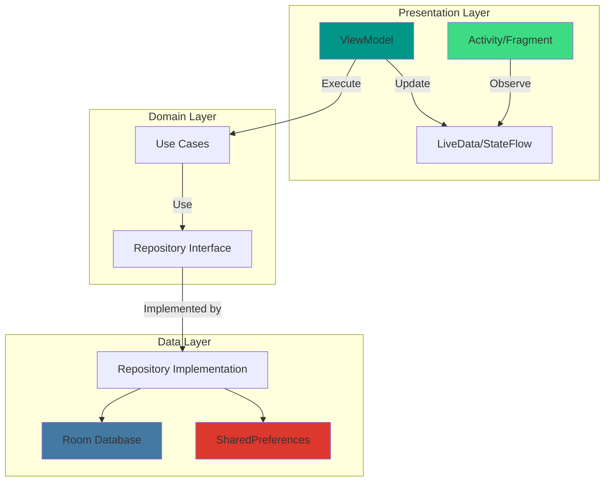
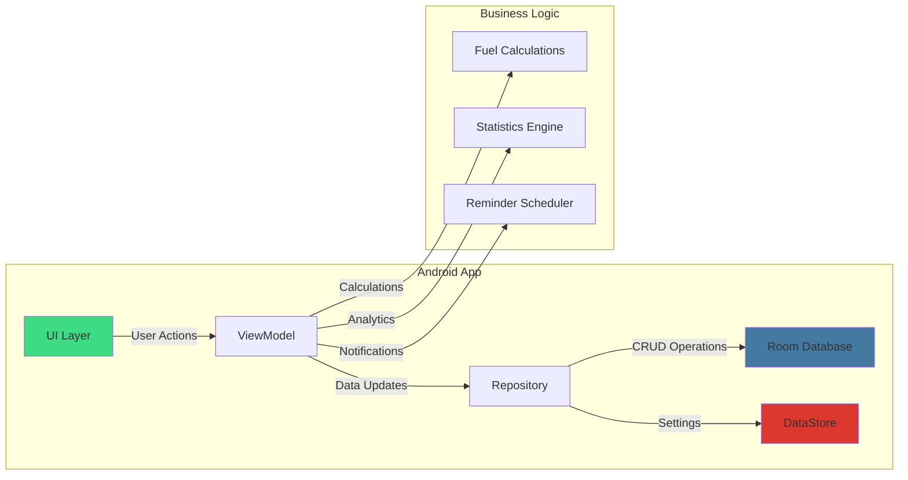
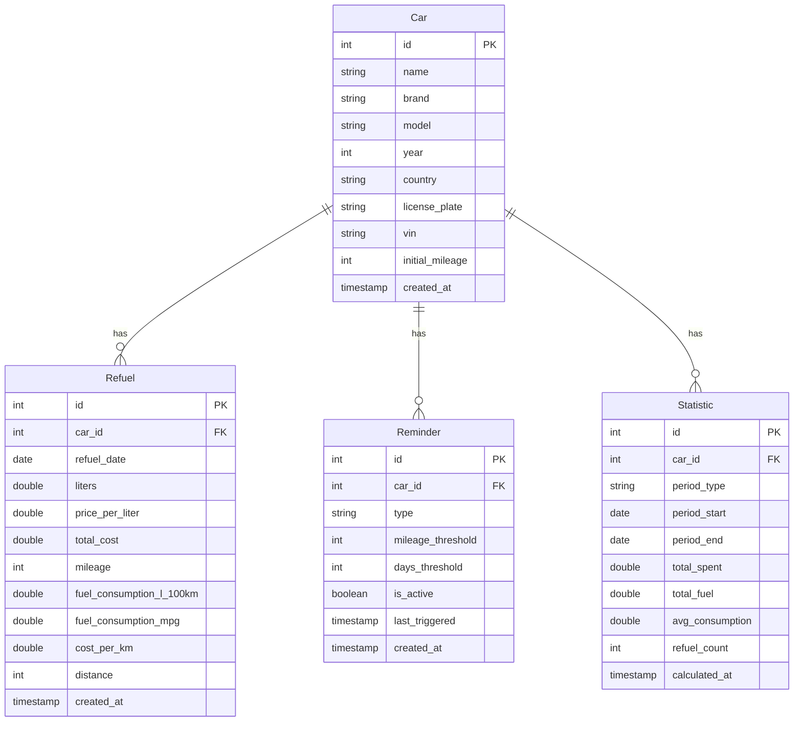

# Car Log 🚗⛽

Мобильное приложение для Android для учета заправок автомобиля, отслеживания расхода топлива и контроля расходов.


## 📋 Содержание

- [Описание](#описание)
- [Возможности](#возможности)
- [Архитектура](#архитектура)
- [База данных](#база-данных)
- [Технологический стек](#технологический-стек)
- [Установка и запуск](#установка-и-запуск)
- [Конфигурация](#конфигурация)
- [Инструкция для пользователей](#инструкция-для-пользователей)
- [Разработка](#разработка)

## 📖 Описание

Car Log - это мобильное приложение, которое помогает владельцам автомобилей вести учет заправок, контролировать расход топлива и анализировать расходы на топливо. Приложение позволяет добавлять несколько автомобилей, записывать каждую заправку, просматривать статистику и устанавливать напоминания о следующей заправке.

## ✨ Возможности

- 🚗 Учет автомобилей - добавление и редактирование информации об автомобилях (марка, модель, год, VIN, номерной знак)
- ⛽ Учет заправок - запись каждой заправки (дата, количество литров, цена за литр, пробег)
- 📊 Статистика - подробная статистика по расходу топлива (средний расход, общие затраты, помесячная детализация)
- 🔔 Напоминания - установка напоминаний о необходимости заправки
- 🌙 Темная тема - поддержка светлой и темной тем, а также системной темы
- 🌍 Локализация - поддержка русского, английского, немецкого и испанского языков
- 📈 Аналитика - расчет средней стоимости за км, частоты заправок, общего расхода
- 💾 Локальное хранение - все данные хранятся локально на устройстве

## 🏗️ Архитектура

Приложение построено по архитектуре MVVM (Model-View-ViewModel) с использованием компонентов Android Jetpack.

### Общая архитектура



### Детальная архитектура сервера



## 💾 База данных

### ER-диаграмма



### Структура основных таблиц

Автомобили
- Car - информация об автомобилях пользователя

Заправки
- Refuel - история заправок для каждого автомобиля со всей метаинформацией

Напоминания
- Reminder - напоминания о необходимости заправки (по пробегу или времени)

Статистика
- Statistic - предварительно рассчитанная статистика по периода

## 🛠️ Технологический стек

### Frontend (Android)

- **Язык**: Kotlin
- **Минимальный SDK**: API 24 (Android 7.0)
- **Целевой SDK**: API 35
- **Архитектура**: MVVM (Model-View-ViewModel)
- **Основные библиотеки**:
    - AndroidX Lifecycle - ViewModel, LiveData
    - Room 2.5.0 - локальная база данных
    - Material Design Components - UI компоненты
    - AndroidX Navigation - навигация между экранами
    - AndroidX DataStore - хранение настроек
    - AndroidX WorkManager - фоновые задачи для напоминаний
    - MPAndroidChart - графики и диаграммы для статистики


## 🚀 Установка и запуск

### Требования

- Android Studio Flamingo или новее
- JDK 11+
- Android SDK 34+

### Установка

1. Клонируйте репозиторий:

```bash
git clone <repository-url>
cd car-log
```

2. Откройте проект в Android Studio

3. Синхронизируйте Gradle зависимости

4. Запустите приложение на эмуляторе или физическом устройстве

## ⚙️ Конфигурация

Настройки приложения
Приложение поддерживает следующие настройки:

Тема
- Светлая
- Темная
- Системная (следует за системными настройками)

Язык
- Русский
- English
- Deutsch
- Español

Единицы измерения
- Расход топлива: л/100км
- Объем топлива: литры или галлоны
- Расстояние: километры или мили


## 🔧 Разработка

### Структура проекта

'''
car-log/
├── app/
│   ├── src/
│   │   ├── main/
│   │   │   ├── java/dm/com/carlog/
│   │   │   │   ├── component/
│   │   │   │   │   ├── DatePickerModal.kt
│   │   │   │   │   ├── DeleteBottomSheet.kt
│   │   │   │   │   ├── DetailCard.kt
│   │   │   │   │   ├── DetailHeader.kt
│   │   │   │   │   ├── DetailStats.kt
│   │   │   │   │   ├── DetailTopButtons.kt
│   │   │   │   │   ├── FuelFormBottomSheet.kt
│   │   │   │   │   ├── FuelItem.kt
│   │   │   │   │   ├── FuelItemDetail.kt
│   │   │   │   │   ├── ReminderDialog.kt
│   │   │   │   │   ├── SectionDivider.kt
│   │   │   │   │   ├── SettingsScreen.kt
│   │   │   │   │   ├── StatisticsCard.kt
│   │   │   │   │   ├── VehicleFormBottomSheet.kt
│   │   │   │   │   └── VehicleItem.kt
│   │   │   │   ├── data/
│   │   │   │   │   ├── expense/
│   │   │   │   │   │   ├── ExpenseCategory.kt
│   │   │   │   │   │   ├── ExpenseCategoryDao.kt
│   │   │   │   │   │   └── ExpenseCategoryRepository.kt
│   │   │   │   │   ├── fuel/
│   │   │   │   │   │   ├── Fuel.kt
│   │   │   │   │   │   ├── FuelDao.kt
│   │   │   │   │   │   └── FuelRepository.kt
│   │   │   │   │   ├── reminder/
│   │   │   │   │   │   ├── Reminder.kt
│   │   │   │   │   │   ├── ReminderDao.kt
│   │   │   │   │   │   ├── ReminderRepository.kt
│   │   │   │   │   │   └── ReminderType.kt
│   │   │   │   │   ├── vehicle/
│   │   │   │   │   │   ├── Vehicle.kt
│   │   │   │   │   │   ├── VehicleDao.kt
│   │   │   │   │   │   ├── VehicleRepository.kt
│   │   │   │   │   │   └── VehicleWithStats.kt
│   │   │   │   │   ├── AppDatabase.kt
│   │   │   │   │   └── AppPreferenceManager.kt
│   │   │   │   ├── di/
│   │   │   │   │   ├── AppModule.kt
│   │   │   │   │   └── DataStoreModule.kt
│   │   │   │   ├── model/
│   │   │   │   │   ├── DeleteViewModel.kt
│   │   │   │   │   ├── FuelFormViewModel.kt
│   │   │   │   │   ├── FuelViewModel.kt
│   │   │   │   │   ├── ReminderViewModel.kt
│   │   │   │   │   ├── SettingsViewModel.kt
│   │   │   │   │   ├── StatisticsViewModel.kt
│   │   │   │   │   ├── VehicleFormViewModel.kt
│   │   │   │   │   └── VehicleViewModel.kt
│   │   │   │   ├── theme/
│   │   │   │   │   ├── AppTheme.kt
│   │   │   │   │   ├── CarLogTheme.kt
│   │   │   │   │   ├── Color.kt
│   │   │   │   │   ├── Theme.kt
│   │   │   │   │   └── Type.kt
│   │   │   │   ├── util/
│   │   │   │   │   ├── DateUtils.kt
│   │   │   │   │   ├── Helper.kt
│   │   │   │   │   ├── LocaleHelper.kt
│   │   │   │   │   ├── PastOrPresentSelectableDates.kt
│   │   │   │   │   ├── CarLogApplication.kt
│   │   │   │   │   └── MainActivity.kt
│   │   │   │   ├── view/
│   │   │   │   │   ├── Detail.kt
│   │   │   │   │   ├── Home.kt
│   │   │   │   │   ├── RemindersScreen.kt
│   │   │   │   │   ├── StatisticsScreen.kt
│   │   │   │   │   └── CarLog.kt
│   │   │   │   └── ... (дополнительные файлы)
│   │   │   └── res/
│   │   │       ├── drawable/
│   │   │       ├── mipmap-anydpi-v26/
│   │   │       ├── mipmap-hdpi/
│   │   │       ├── mipmap-mdpi/
│   │   │       ├── mipmap-xxhdpi/
│   │   │       ├── mipmap-xxxhdpi/
│   │   │       ├── values/
│   │   │       │   ├── colors.xml
│   │   │       │   ├── dimens.xml
│   │   │       │   ├── ic_launcher_background.xml
│   │   │       │   ├── strings.xml
│   │   │       │   └── themes.xml
│   │   │       ├── values-de/
│   │   │       │   └── strings.xml
│   │   │       ├── values-es/
│   │   │       │   └── strings.xml
│   │   │       ├── values-ru/
│   │   │       │   └── strings.xml
│   │   │       ├── xml/
│   │   │       │   ├── backup_rules.xml
│   │   │       │   └── data_extraction_rules.xml
│   │   │       └── AndroidManifest.xml
│   │   └── test/
│   └── build.gradle.kts
└── README.md
'''
## 📝 Лицензия

MIT License

## 👥 Авторы

Разработано для проекта Car Log

Версия приложения: 1.0.0
Последнее обновление: Декабрь 2025


